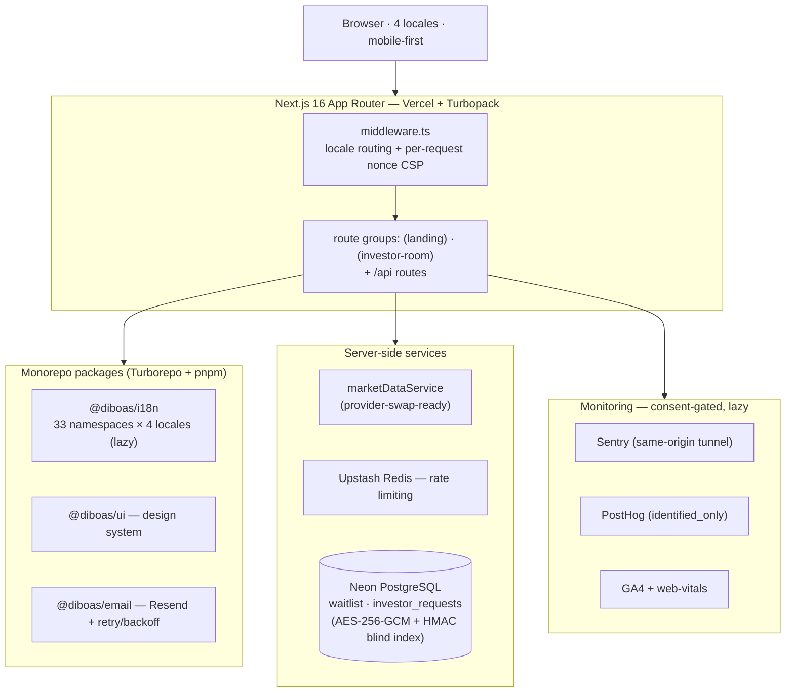

# diBoaS Platform

Goal-driven wealth building platform. Open access and fair opportunities for everyone.

## Overview

diBoaS is a pre-launch marketing site with waitlist functionality, interactive demo, and goal calculator. Live at [diboas.com](https://diboas.com) in 4 languages.

**Current phase:** Pre-launch waitlist. Live since March 11, 2026.

## Tech Stack

- **Framework:** Next.js 16.2.6 (App Router, Turbopack)
- **Language:** TypeScript ~5.9.3 (strict mode)
- **UI:** React 18.3.1, Tailwind CSS 3.4.17
- **Monorepo:** Turborepo 2.8.15 + pnpm 8.15.0
- **i18n:** react-intl 6.4.7 (4 locales: en, pt-BR, es, de)
- **Testing:** Vitest 4.1.5, @vitest/coverage-v8, Lighthouse CI, pa11y
- **Monitoring:** Sentry 10.49.0 (errors + session replay), PostHog (product analytics), GA4 (traffic), web-vitals
- **Security:** DOMPurify 3.4.1, Upstash Redis (rate limiting), AES-256-GCM encryption, HMAC blind indexing
- **Email:** Resend (transactional email with circuit breaker)
- **Database:** Neon PostgreSQL (serverless)
- **Component dev:** Storybook 10.3.5
- **Hosting:** Vercel (auto-deploy from main branch)
- **DNS:** Cloudflare (DNS-only mode)

## Architecture

The repository today is the **pre-launch marketing site** — a single Next.js app in a Turborepo monorepo. The diagram below reflects what is actually built and running; the product's non-custodial money architecture is a **Phase 2+ roadmap** (see "Planned product architecture" below), not part of the current build.



### Engineering posture (built — verifiable in this repo)

- **Testing & CI:** strict TypeScript, ~1,136 automated tests (Vitest), Lighthouse CI + pa11y (WCAG 2.1 AA), and 5 GitHub Actions workflows (CI, security audit, accessibility, E2E, Lighthouse).
- **Security:** per-request **nonce-based CSP** (`'unsafe-inline'` prohibited for scripts), **AES-256-GCM** encryption for PII at rest, **HMAC blind indexing**, Upstash rate limiting, DOMPurify sanitization, and CSRF protection on mutation endpoints.
- **i18n:** 33 namespaces × 4 locales, lazy-loaded per locale × namespace, drift-guarded by a parity test.
- **Monitoring:** Sentry, PostHog, and GA4 — all consent-gated and lazy-loaded behind a cookie-consent check.

> **Product architecture is Phase 2+, not in this build.** The money product's design — non-custodial by design (users hold their own funds; diBoaS holds no key shares, and recovery runs through an integrated third-party provider), MPC wallets (Turnkey), multi-chain DeFi (stable strategies on Arbitrum, growth on Solana) — is roadmap. Those decisions live in [`CLAUDE.md`](./CLAUDE.md); the full technical write-up for reviewers belongs in the investor room's technical-architecture summary.

## Prerequisites

- **Node.js:** >= 22.0.0
- **pnpm:** >= 8.0.0

```bash
# Install pnpm via Corepack (recommended)
corepack enable
corepack prepare pnpm@8.15.0 --activate
```

## Installation

```bash
git clone <repository-url>
cd diboas-platform
pnpm install
```

## Development

```bash
pnpm dev:web          # Start web app dev server
pnpm dev:fresh        # Clean rebuild + dev server (use after package changes)
pnpm dev:reset        # Clean build cache + restart
```

The app is available at http://localhost:3000. Locale routes: `/en`, `/pt-BR`, `/es`, `/de`.

## Project Structure

```
diboas-platform/
  apps/web/              # Next.js web application
    src/
      app/               # App Router (pages, API routes, layouts)
      components/        # UI components (Factory pattern with variants)
      config/            # Feature configs, page configs, navigation
      hooks/             # Custom React hooks
      lib/               # Utilities, security, services, analytics
      styles/            # Global CSS, design tokens
      types/             # TypeScript type definitions
    public/              # Static assets (images, logos, favicon)
  packages/
    email/               # @diboas/email — Transactional email (Resend)
    i18n/                # @diboas/i18n — Internationalization (4 locales)
    ui/                  # @diboas/ui — Design system components
    banking/             # @diboas/banking — Phase 2+ stub
    defi/                # @diboas/defi — Phase 2+ stub
    investing/           # @diboas/investing — Phase 2+ stub
  config/                # Design tokens JSON + schema
  scripts/               # Build/validation scripts
  docs/                  # Documentation
```

## Commands

```bash
# Development
pnpm dev:web                   # Start web app
pnpm dev:fresh                 # Clean rebuild + start

# Quality
pnpm type-check                # TypeScript checking
pnpm lint                      # ESLint
pnpm test                      # Vitest (unit + integration)
pnpm build                     # Production build

# Validation
pnpm validate:all              # Full pipeline
pnpm validate:translations     # Translation key parity (4 locales)
pnpm validate:design-tokens    # Design tokens schema
pnpm check:dead-code           # Dead code detection (knip)

# Audits
pnpm audit:full                # 15-point pre-launch audit
pnpm security:audit            # pnpm audit (production deps)
pnpm performance:audit         # Lighthouse CI
pnpm accessibility:audit       # pa11y WCAG2AA
```

## Environment Variables

Copy `.env.example` and configure:

```bash
cp apps/web/.env.example apps/web/.env.local
```

Required for production: `NEXT_PUBLIC_BASE_URL`, `DATABASE_URL`, `RESEND_API_KEY`, `EMAIL_FROM_ADDRESS`, `ENCRYPTION_KEY`, `HMAC_KEY`, `INTERNAL_API_KEY`, `NEXT_PUBLIC_SENTRY_DSN`, `NEXT_PUBLIC_GA_ID`, `NEXT_PUBLIC_POSTHOG_KEY`, `UPSTASH_REDIS_REST_URL`, `UPSTASH_REDIS_REST_TOKEN`. (The CSP nonce is generated per-request in `middleware.ts` — no secret env var needed.)

Full reference: `docs/monitoring/INFRASTRUCTURE_GUIDE.md`.

## Pages

| Route                          | Description                                                                                                |
| ------------------------------ | ---------------------------------------------------------------------------------------------------------- |
| `/`                            | B2C landing page (waitlist, comparison table, goals, demo)                                                 |
| `/business`                    | B2B landing page (Payment Fees + Idle Cash goal cards)                                                     |
| `/about`                       | About page (founder story, mission, beliefs)                                                               |
| `/strategies`                  | Investment strategies                                                                                      |
| `/protocols`                   | Protocol transparency                                                                                      |
| `/help`                        | Help center (6 FAQ topics)                                                                                 |
| `/security`                    | Security information                                                                                       |
| `/demo`                        | Interactive financial demo                                                                                 |
| `/dream-mode`                  | Goal calculator simulation                                                                                 |
| `/learn/compound-interest`     | Lesson 01 — How Money Really Grows (3-beat lesson + calculator)                                            |
| `/tools`                       | Money tools landing — purpose-grouped calculators                                                          |
| `/tools/compound-interest`     | Compound interest calculator (tool variant — currency-hedge for non-USD)                                   |
| `/tools/retirement`            | Retirement planning calculator                                                                             |
| `/tools/goal-savings`          | Goal savings calculator                                                                                    |
| `/tools/emergency-fund`        | Emergency fund time-to-target calculator                                                                   |
| `/tools/inflation-impact`      | Inflation impact calculator                                                                                |
| `/tools/time-to-target`        | Time-to-target calculator                                                                                  |
| `/tools/currency-depreciation` | Currency depreciation calculator (with hedge math)                                                         |
| `/tools/asset-history`         | Retrospective asset DCA replay (8 assets, monthly-precision FX path for cross-currency)                    |
| `/tools/card-fees`             | B2B card fee savings calculator                                                                            |
| `/tools/idle-cash`             | B2B idle cash yield calculator                                                                             |
| `/market`                      | Adelaide Daily — BTC macro-regime dashboard (host surface for diboas-analytics)                            |
| `/investors`                   | Investor vertical — public pitch page (thesis, market, raise)                                              |
| `/investor-room`               | Password-gated investor room — full documents + print-to-PDF (noindex; EN + pt-BR native, DE/ES render EN) |
| `/email-preferences`           | Email unsubscribe / notification preferences                                                               |
| `/delete-confirm`              | GDPR account/waitlist deletion confirmation                                                                |
| `/share`                       | Social sharing redirect (OG metadata)                                                                      |
| `/legal/*`                     | Terms, Privacy, Cookies                                                                                    |

All pages available in `/en`, `/pt-BR`, `/es`, `/de`.

## Architecture Highlights

- **Factory pattern** with variants for components
- **4-layer error boundaries:** global > app > locale > route group + per-section
- **Nonce-based CSP** generated per-request (no `unsafe-inline` for scripts)
- **GDPR consent-gated analytics:** GA4 + PostHog only after "Accept"
- **PII encryption:** AES-256-GCM with HMAC blind indexing
- **Distributed rate limiting:** Upstash Redis with in-memory fallback
- **Email circuit breaker:** 3-layer resilience (retry + client error detection + circuit breaker)
- **Database query timeouts:** 8s timeout prevents hung serverless functions
- **10-calculator tool suite** (8 forward + asset-history retrospective + tools landing) with split engine (lesson non-hedged vs tools currency-hedged for non-USD locales); canonical effective-rate model `(1 + usdYield)(1 + localDep) − 1`
- **Service-agnostic numeric data:** all rates, inflation, depreciation, fees flow through `marketDataService.getSync()` (provider-swap-ready for live API)
- **"Digital dollar" terminology:** body copy avoids crypto/DeFi jargon; technical terms reserved for regulatory disclosures (MiCA / CVM / FTC / TILA)

## Documentation

`CLAUDE.md` is the source of truth for current decisions, conventions, and architecture. Each doc below owns one topic — point to it rather than duplicating its facts.

| Topic                                                                        | Canonical doc                                   |
| ---------------------------------------------------------------------------- | ----------------------------------------------- |
| Current decisions, coding standards, conventions                             | `CLAUDE.md`                                     |
| Engineering guides (frontend, security, i18n, monitoring ops, design system) | `docs/tech/`                                    |
| Financial / currency-hedge math                                              | `docs/tech/financial-calculations.md`           |
| Money Tools suite + validation + weekly data runbook                         | `docs/tools/` · `docs/tech/TOOLS_VALIDATION.md` |
| Monitoring ops + invariants                                                  | `docs/tech/MONITORING_OPS.md`                   |
| Env vars + deploy values                                                     | `docs/monitoring/INFRASTRUCTURE_GUIDE.md`       |
| "Do-not-regress" decision register                                           | `docs/tech/implementation-notes.md`             |
| Fees (canonical)                                                             | `docs/full-view/FEES.md`                        |
| Business model, brand, wallet/custody architecture                           | `docs/full-view/`                               |
| Audit history, security findings, pending work                               | `docs/audit/` · `docs/security/`                |
| `diboas-analytics` (separate product hosted at `/market`)                    | `docs/mvp/`                                     |
| Regulatory + market deep-research (reference)                                | `docs/researches/`                              |
| Phase-2 forward analysis (aspirational — verify vs `CLAUDE.md`)              | `docs/roadmap/`                                 |
